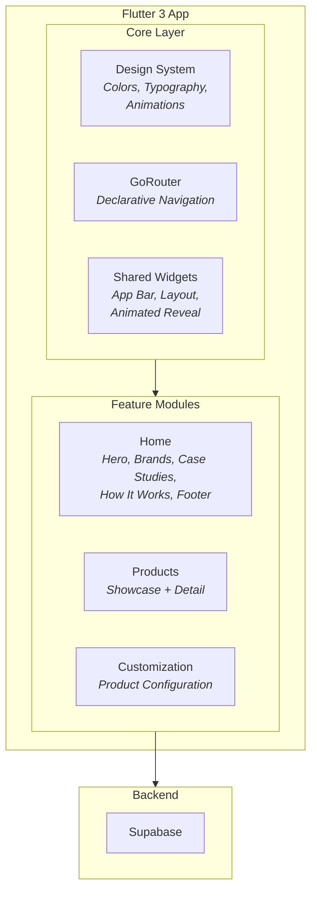

# Sawa Threads — Custom Apparel E-Commerce Platform

A production-grade Flutter web and mobile app for a custom apparel brand. Features product customization, scroll-driven animations, parallax effects, and a clean architecture foundation built for scale.


## The Problem

Custom apparel brands need an online presence that showcases their craftsmanship, lets customers configure products, and presents case studies of past work — all while feeling premium. Off-the-shelf e-commerce templates don't cut it.

## What It Does

- **Product Showcase** — Hero sections with parallax scrolling, product detail pages with image galleries, and a "how it works" explainer flow
- **Product Customization** — Configure apparel options (fabric, color, sizing) with a dedicated customization screen
- **Case Studies** — Portfolio section showcasing past brand work with rich media
- **Brand Partnerships** — Animated partner logo carousel
- **Responsive Design** — Adaptive layouts for web, tablet, and mobile with a custom responsive layout system
- **Design System** — Full custom theme with color schemes, text themes, and animation extensions

## Architecture



## Technical Highlights

- **Clean Architecture** — Feature-first organization with strict separation between core (theme, routing, shared widgets) and feature modules (home, products, customization). Each feature owns its screens and widgets.
- **Custom Scroll Conductor** — A `ScrollConductor` utility orchestrates scroll-triggered animations across sections, enabling cinematic page transitions and parallax effects without a heavy animation library.
- **Full Design System** — Not just a theme file — includes `color_schemes.dart`, `text_themes.dart`, and `animation_extensions.dart` that define every visual token. Light and dark mode support built in.
- **Animated Reveal System** — Custom `AnimatedReveal` widget that triggers entrance animations as elements scroll into view, creating a polished editorial feel.
- **Multi-Platform** — Single codebase targeting web (primary), iOS, Android, macOS, Windows, and Linux.

## Tech Stack

| Layer | Technology |
|-------|-----------|
| Framework | Flutter 3, Dart 3 |
| Architecture | Clean Architecture, feature-first |
| Backend | Supabase |
| Navigation | GoRouter (declarative, deep-linking ready) |
| Animations | Custom scroll-triggered motion, parallax, animated reveals |
| Theming | Custom design system with light/dark support |
| Layout | Custom responsive layout system |

## Running Locally

```bash
git clone https://github.com/thisisyoussef/sawa.git
cd sawa
flutter pub get
flutter run -d chrome    # Web
flutter run              # Mobile
```

## Project Structure

```
lib/
├── core/
│   ├── constants/              # Routes, design system tokens
│   ├── theme/                  # Color schemes, text themes, animation extensions
│   ├── utils/                  # Router config, scroll conductor
│   └── widgets/                # AnimatedReveal, responsive layout, app bar
├── features/
│   ├── home/
│   │   └── presentation/
│   │       ├── screens/        # Home screen, debug tools
│   │       └── widgets/        # Hero, brands carousel, case studies,
│   │                           # features/benefits, how it works, footer
│   ├── products/
│   │   └── presentation/
│   │       └── screens/        # Product showcase, product detail
│   └── product_customization/
│       └── presentation/
│           └── screens/        # Customization flow
└── data/                       # Sample data (case studies, partners, products)
```
